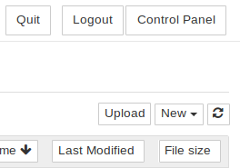

## JupyterHub programming environment with student Notebooks

#### Secondary schools may want to consider JupyterHub to integrate coding with dynamic interactive graphing — A New Way to Think About Programming — allowing students to integrate science experiment results and program output within their own blog-like "Jupyter Notebooks."

* Jupyter Notebooks are widely used in the scientific community:
  * [Institutional FAQ](https://jupyterhub.readthedocs.io/en/stable/getting-started/institutional-faq.html)
  * [Getting Started](https://jupyterhub.readthedocs.io/en/stable/getting-started/)
* Students create their own accounts on first use — e.g. at http://box.lan/jupyterhub — just as if they're logging in regularly (unfortunately the login screen doesn't make that clear, but the teacher _does not_ need to be involved!)
  * A student can then sign in with their username and password, to gain access to their files (Jupyter Notebooks).
  * The teacher should set and protect JupyterHub's overall `Admin` password, just in case.  As with student accounts, the login screen doesn't make that clear — so just log in with username `Admin` — using any password that you want to become permanent.
* Individual student folders are created in `/var/lib/private/` on the Internet-in-a-Box (IIAB) server:
  * A student will only be able to see their own work — they do not have privileges outside of their own folder.
  * Students may upload Jupyter Notebooks to the IIAB server, and download the current state of their work via a normal browser.

### Settings

Linux administrators may want to review `/opt/iiab/jupyterhub/etc/jupyterhub/jupyterhub_config.py` which originates from:

https://github.com/iiab/iiab/blob/master/roles/jupyterhub/templates/jupyterhub_config.py

In some rare circumstances, it may be necessary to restart JupyterHub's systemd service:

```
sudo systemctl restart jupyterhub
```

FYI `/opt/iiab/jupyterhub` is a Python 3 virtual environment, that can be activated with the usual formula:

```
source /opt/iiab/jupyterhub/bin/activate
```

Passwords are hashed using 4096 rounds of the latest Blowfish (bcrypt's $2b$ algorithm) and stored in:

```
/opt/iiab/jupyterhub/etc/passwords.dbm.db
```

### Users can change their own password

Users can change their password by logging in, and then visiting URL: http://box.lan/jupyterhub/auth/change-password

NOTE: This is the only way to change the password for user 'Admin', because Control Panel > Admin (below) does not permit deletion of this account.

### Control Panel > Admin page, to manage other accounts

The `Admin` user (and any users given `Admin` privilege) can reset user passwords by deleting the user from JupyterHub's **Admin** page (below).  This logs the user out, but does not remove any of their data or home directories.  The user can then set a new password in the usual way — simply by logging in.  Example:

1. As a user with `Admin` privilege, click **Control Panel** in the top right of your JupyterHub:

   

2. In the Control Panel, open the **Admin** link in the top left:

   

   This opens up the JupyterHub Admin page, where you can add / delete users, start / stop peoples’ servers and see who is online.

3. Delete the user whose password needs resetting.  Remember this does not delete their data or home directory:

   

   If there is a confirmation dialog, confirm the deletion.  This will also log the user out, if they were currently running.

4. Re-create the user whose password needs resetting, on this same screen.

5. Ask the user to log in, but with a new password of their choosing.  This will be their password going forward.

_WARNING: If on login users see "500 : Internal Server Error", you may need to remove ALL files of the form_ `/run/jupyter-johndoe-singleuser`

### PAWS/Jupyter Notebooks for Python Beginners

While PAWS is a little bit off topic, if you have an interest in Wikipedia, please do see this 23m 42s video ["Intro to PAWS/Jupyter notebooks for Python beginners"](https://www.youtube.com/watch?v=AUZkioRI-aA&list=PLeoTcBlDanyNQXBqI1rVXUqUTSSiuSIXN&index=8) by Chico Venancio, from 2021-06-01.

He explains PAWS as a "powerful Python execution environment http://paws.wmcloud.org [allowing] ordinary folks to write interactive scripts to work with Wikimedia content."
